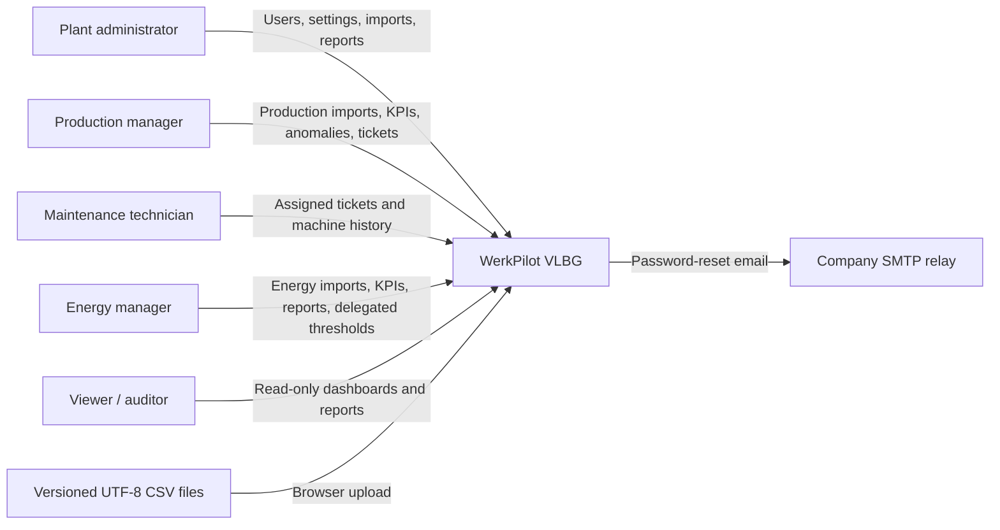
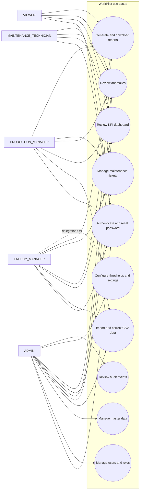
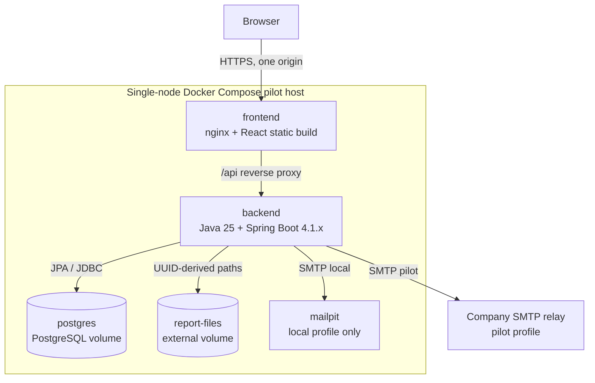
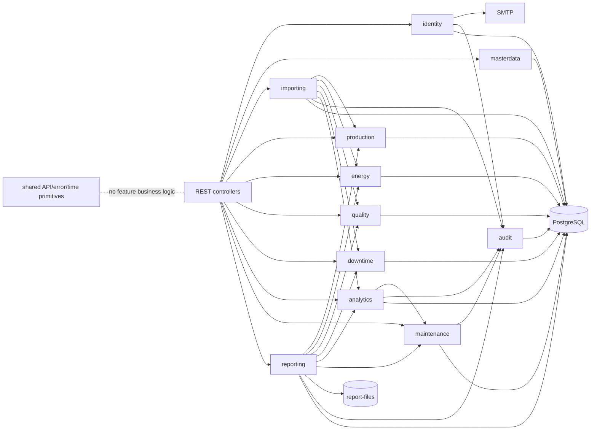
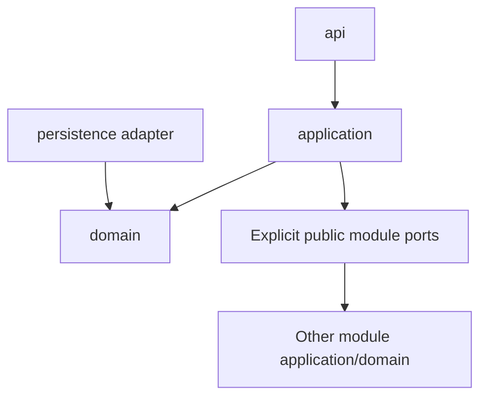

# Architecture

## Architectural position

WerkPilot is one single-tenant, single-node web application for industrial
decision support. The backend is one deployable Java modular monolith. Its
business modules communicate in process through explicit application/domain
interfaces; they are not network services.

## System context

The system does not connect to PLC, SCADA, HMI, ERP, OPC UA, MQTT, Modbus, or
industrial gateways and never actuates a machine.

## Use-case view

Every connection is constrained by the Section 8 permission matrix. The
backend is authoritative; this view does not grant permissions beyond it.

## Container and deployment view

- `postgres`: persistent PostgreSQL data; schema only through Liquibase.
- `backend`: Java 25 modular monolith, port 8080 internally.
- `frontend`: nginx static frontend and same-origin `/api` proxy.
- `mailpit`: local-only password-reset mail catcher.
- `report-files`: externalized report storage outside the web root, backed up
  with PostgreSQL and subject to 24-month operational retention.

Pilot deployment is single-node and business-hours oriented. High availability
and automated disaster recovery are out of scope.

## Backend component view

The arrows describe allowed orchestration, not direct access to another
module's persistence package.

## Module ownership

| Module | Owns |
| --- | --- |
| `identity` | Authentication, users, fixed roles, refresh/reset tokens, mail orchestration. |
| `masterdata` | Factories, lines, machines, products, shifts, reasons, categories, global settings. |
| `importing` | Async jobs, hashing, strict parsing, validation, errors, correction/rollback lineage. |
| `production` | Production records and output KPIs. |
| `energy` | Energy measurements, granularity/XOR rules, thresholds, energy KPIs. |
| `quality` | Scrap records/categories and quality KPIs. |
| `downtime` | Downtime records/reasons, availability, Pareto output. |
| `analytics` | Detection identity, rerun/supersession, severity, recommendations. |
| `maintenance` | Tickets, assignment, comments, due date, computed overdue, transitions. |
| `reporting` | PDF rendering, CSV evidence, report metadata/files/download. |
| `audit` | Append-only events and ADMIN-only views. |
| `shared` | Error model, pagination, aggregate/filter/job records, validation and clock primitives. |

`shared` is not a dumping ground.

## Package dependency rules

- Controllers call application services, never repositories.
- Application services own use cases, transactions, orchestration, and ports.
- Domain owns entities, enums, policies, and pure calculations.
- Persistence implements repository ports; its types never cross modules/API.
- JPA entities never cross the REST boundary.
- Cross-module cycles and access to another module's persistence are forbidden.
- Architecture rules become executable tests in Sprint 0.

## Critical flows

### Asynchronous CSV import

1. Authorize the import type, enforce size, and compute SHA-256 while streaming.
2. Persist a `PROCESSING` job and return its shared job response.
3. Validate exact headers and all rows with bounded resources; resolve existing
   master-data codes without implicit creation.
4. Persist at most 500 German error details and mark FAILED, or atomically
   commit every row and mark COMMITTED.
5. Run deterministic post-import analytics after commit.
6. For correction/rollback, atomically supersede the target job and rerun
   analytics so anomaly supersession follows Section 23.4.

### Dashboard

1. Parse and authorize one typed filter object.
2. Query only rows belonging to COMMITTED jobs and fully contained in the
   canonical `[from,to)` window.
3. Calculate authoritative KPIs in pure backend services.
4. Return shared aggregate values and applied filters.
5. The frontend only formats and visualizes the values.

### Password reset

1. Return the same `202` regardless of account existence.
2. When appropriate, hash/store a one-time 60-minute token and send a German
   link whose token is in the URL fragment.
3. Confirmation consumes the token, changes the BCrypt password, revokes all
   refresh tokens, and writes the required audit event.

### Monthly report

1. Persist a report run and normalized filters.
2. Obtain projections from module application ports.
3. Render the fixed PDF with the exact disclaimer.
4. Store it under a UUID-derived path in `report-files` and audit generation.
5. Download only through authorization; return `404` if the file is absent and
   never silently regenerate it.

## Cross-cutting rules

- Store timestamps in UTC; display Europe/Vienna and inject `Clock`.
- Use structured JSON pilot logs with trace/user IDs when available.
- Protect Actuator and OpenAPI outside local development.
- Centralize sanitized errors in `@ControllerAdvice`.
- Generate OpenAPI 3.1 and use it to type frontend access.
- Keep all secrets outside source control and frontend/image layers.
