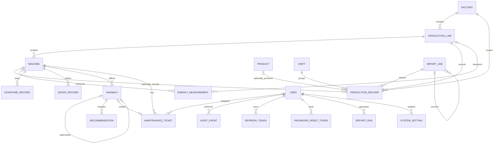

# Domain Model

## Model principles

- UUID primary keys and explicit PostgreSQL foreign keys.
- Mutable business records carry creation/update actor and timestamp fields.
- Master data uses soft deletion when historical records reference it.
- Imported measurements are immutable through normal UI services.
- Audit events and ticket comments are append-only at application level.
- Every imported measurement links to an `import_job`.
- Measurement intervals are half-open: `[period_start, period_end)`.

## Logical relationships

## Source-defined entities

### Machine

| Field | Type | Invariant |
| --- | --- | --- |
| `id` | UUID | Backend-generated primary key. |
| `code` | varchar(40) | Unique per factory. |
| `name` | varchar(120) | Required. |
| `production_line_id` | UUID | Required FK. |
| `machine_type` | varchar(80) | Optional. |
| `status` | enum | `ACTIVE`, `INACTIVE`, `MAINTENANCE`, `RETIRED`. |
| `rated_power_kw` | decimal | Optional and non-negative. |
| `commissioned_at` | date | Optional. |
| `deleted` | boolean | Required soft-delete flag. |

### Production record

Required fields are interval, factory, line, optional machine, optional
product, shift, non-negative units, optional 80-character batch code, and
import job.

### Energy measurement

Required fields are interval, shift, non-negative `energy_kwh decimal(12,3)`,
source enum, and import job. Exactly one of `machine_id` or `line_id` is set,
enforced by an XOR database constraint. The row source matches the job type:
normal imports use `CSV`; corrections use `MANUAL_CORRECTION`.

### Other required persistence

The normative model also requires users and fixed roles, hashed refresh-token
identifiers, hashed password-reset tokens, factories, products, shifts,
downtime reasons, scrap categories, import jobs/errors, production/energy/
downtime/scrap records, anomalies, recommendations, thresholds, maintenance
tickets/comments, audit events, report runs, and `system_settings`.

v2.1 requires these additional fields/relationships:

- `import_jobs.corrects_import_job_id` for correction lineage;
- measurement-level superseded retention through the owning job status;
- anomaly `supersedes` / `superseded_by` links;
- optional `maintenance_tickets.due_date`;
- report file metadata keyed by the `report_run` UUID;
- `energy_threshold_delegation_enabled` in `system_settings`, default OFF.

Exact columns not explicitly fixed by the DOCX are frozen in reviewed
Liquibase migrations and OpenAPI contracts before dependent implementation.
They must not add new business behavior.

## Invariants

### Identity and settings

- Persist exactly the five approved roles.
- Normalize email and enforce uniqueness.
- Hash passwords with BCrypt strength 12 or greater.
- Store refresh identifiers and one-time reset tokens only as hashes.
- Reset tokens contain at least 128 random bits, expire after 60 minutes, and
  are single-use; successful reset revokes all refresh tokens.
- ADMIN always writes energy thresholds. ENERGY_MANAGER may write them only
  while the global delegation setting is ON; only ADMIN changes that setting.

### Master data

- Line and machine codes are unique within a factory.
- Product, shift, downtime-reason, and scrap-category codes are globally
  unique.
- Soft-deleted records remain resolvable historically and cannot be selected
  for new imports.

### Energy and time

- Each energy row references exactly one machine or production line.
- A line uses machine-level or line-level energy for an overlapping period,
  never both.
- Energy and production are independently summed over the same canonical
  query window. Only fully contained rows contribute; MVP performs no
  proration.
- Store instants in UTC and evaluate display/business dates in Europe/Vienna.

### Imports and correction

- Import type plus SHA-256 is unique for normal imports.
- A rejected import commits zero measurement rows.
- Import errors contain row, column, rejected value, and German message; detail
  stops at 500 while overflow metadata remains accurate.
- Status values are `PROCESSING`, `COMMITTED`, `FAILED`, and `SUPERSEDED`.
- Correction targets one COMMITTED job, validates atomically, links the
  replacement, and supersedes the target. Rollback supersedes without a
  replacement and requires a reason.
- KPI, dashboard, export, report, and analytics queries include only rows whose
  job is `COMMITTED`. Superseded rows remain for lineage/audit only.

### Maintenance

- Allowed transitions are `OPEN -> IN_PROGRESS -> RESOLVED`,
  `OPEN -> CANCELLED`, and `IN_PROGRESS -> CANCELLED`.
- RESOLVED requires a resolution note; CANCELLED requires a reason.
- Resolved/cancelled tickets have no outgoing normal transition.
- Comments are append-only.
- `due_date` is optional and editable only while OPEN or IN_PROGRESS.
  `overdue` is computed at query time when the due date is before the
  Europe/Vienna business date; it is never a persisted status.

### Analytics

- Anomalies retain type, status, severity, explanation, observed/baseline
  values, baseline quality, detection method, affected interval, asset, and
  detector version.
- Detection identity is anomaly type + affected machine/line + shift when
  shift-scoped + affected interval + detector version.
- Unchanged reruns are exact no-ops. Changed results supersede the old anomaly
  and create a linked NEW successor. Disappeared results supersede without a
  successor.
- `SUPERSEDED` is terminal, system-assigned, excluded from active counts, and
  never inherits the user's earlier decision.
- Recommendations retain template code and version.

### Reports, audit, and retention

- Store report metadata in PostgreSQL and files in the external
  `report-files` volume outside the web root. Build paths only from report UUID.
- A missing stored file returns `404` and is never silently regenerated.
- Application services do not mutate/delete audit events.
- The manual retention operation enforces 24 months for operational data and
  report files, 36 months for audit, and records `RETENTION_PURGE_EXECUTED`.

All former OQ schema questions are resolved by v2.1. OQ identifiers in this
documentation are traceability labels, not implementation blockers.
